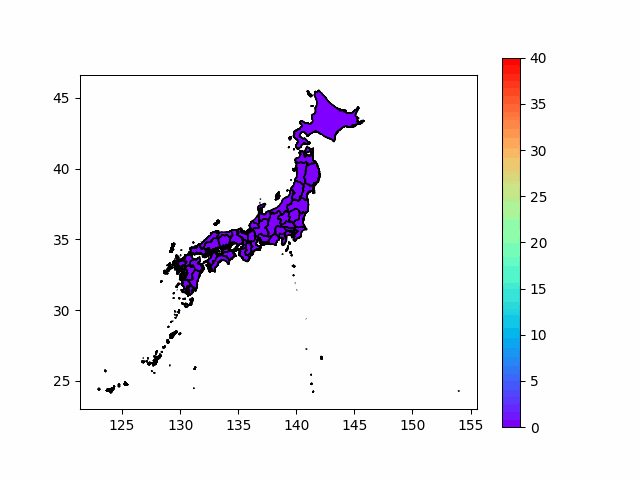
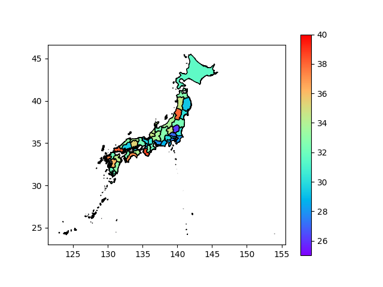

# About
2021年4月12日から7月21日までの日本のワクチン接種率を可視化した。

# result
## 4月12日から7月21日の接種率のアニメーション

## 7月21日の接種率(都道府県ごとの差をわかりやすく色分け)

# How to get data

## geo

` curl -L https://biogeo.ucdavis.edu/data/gadm3.6/shp/gadm36_JPN_shp.zip -o gadm36_JPN_shp.zip `

## vactine

`curl https://vrs-data.cio.go.jp/vaccination/opendata/latest/prefecture.ndjson -o prefecture.ndjson.gz `

## population

`curl "https://www.e-stat.go.jp/stat-search/file-download?statInfId=000031524010&fileKind=1" -o population.csv `
